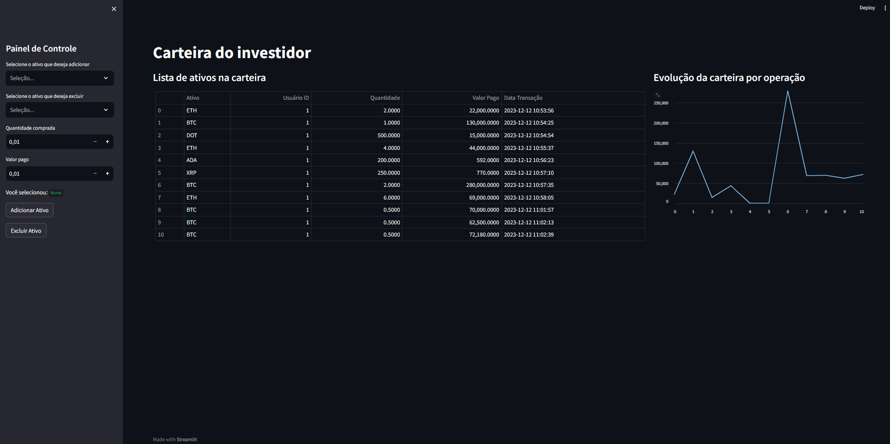

# Projeto de Análise de Criptoativos

Desenvolvimento de uma app de análise de criptoativos conectada a um banco de dados local, permitindo aos usuários adicionar e remover ativos, acompanhar a evolução da carteira por meio de gráficos interativos. Com um banco de dados SQL integrado, o projeto oferecerá uma interface amigável para uma gestão eficiente da carteira de criptoativos, fornecendo informações cruciais para investidores.

Prévia v1.0

